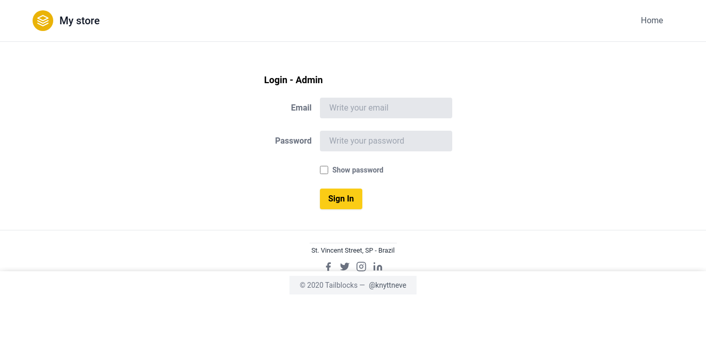

<h1 align="center"> My Store </h1>

  

  <a href="#tecnologies">Tecnologias</a>&nbsp;&nbsp;&nbsp;|&nbsp;&nbsp;&nbsp;
  <a href="#project">Projeto</a>&nbsp;&nbsp;&nbsp;|&nbsp;&nbsp;&nbsp;
    <a href="#orientations">Orientações</a>&nbsp;&nbsp;&nbsp;|&nbsp;&nbsp;&nbsp;
  <a href="#challenges">Desafios</a>&nbsp;&nbsp;&nbsp;|&nbsp;&nbsp;&nbsp;
  <a href="#extres">Extras</a>&nbsp;&nbsp;&nbsp;|&nbsp;&nbsp;&nbsp;
  <a href="#license">Licença</a>

  

 

  

## 🚀 Tecnologias

 Esse projeto foi desenvolvido com as seguintes tecnologias: 

- HTML (Blade template) e CSS (Tailwind);
- JavaScript puro;
- Laravel;
- MySQL;
- NPM e Composer.

## 💻 Projeto

 "My store" é o meu primeiro projeto realizado em Laravel, houve diversos desafios com ele já que era o meu primeiro contato com o Framework. 

  <ul style="margin-left: 20px;">
      <li> Função para ver senha; </li>
      <li> Sistema de paginação simples; </li>
      <li> Upload de imagem para os produtos. </li>
  </ul>

## 🗺️ Orientações

 Você precisa ter NPM, Composer e MySQL instalados em sua máquina. 

<ul style="margin-left: 20px" id="orientations">
  <li> Rode em seu terminal o comando npm install e composer install para instalar as depedências do projeto;</li>
  <li>O Laravel por padrão oferece diversos recursos para se trabalhar com banco de dados, logo não é necessário criar nada, é necessário apenas saber executar as migrations e seeders, fazendo isso o banco estará pronto.</li>
</ul>

## ⚔️ Desafios enfrentados

 Entender a estrutura de pastas e upload de arquivo foram umas das minhas principais dificuldades ao fazer este projeto. 

## 🧑‍🔧 Extras

 
  Algumas Melhorias que devem ser feitas por eu ou até mesmo por você caso queira no futuro:

  <ul style="margin-left: 20px">
      <li> Melhorar paginação; </li>
      <li> Aplicar Vue.js; </li>
      <li> Implementar método de pagamento. </li>
  </ul>

## :memo: Licença

 Esse projeto está sob a licença MIT. 
